# Fly Golf

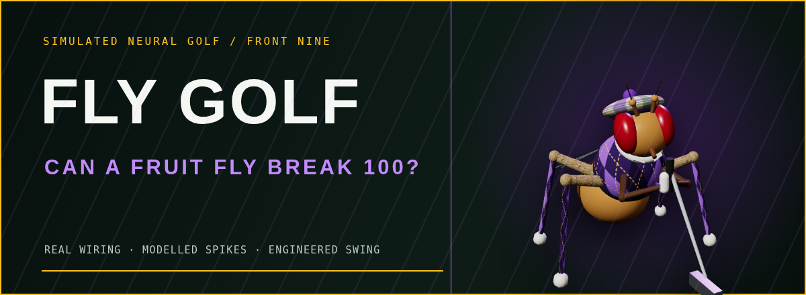

**Can a fruit fly break 100?**

Fly Golf connects simulated neural activity running over the reconstructed **MaleCNS v1.0**
fruit-fly connectome to a fully 3D golf environment. The fly plays a front nine, chooses its own
club from a full bag, sets up every shot, records its neural telemetry, and can use a trained
readout of descending-neuron activity to make its golf decisions.

**[▶ Watch the Web Demo](https://jameskbb.github.io/fly-golf/)** ·
[How It Works](#how-it-works) · [Run It Locally](#run-it-locally) ·
[Scientific Caveats](#scientific-caveats)

[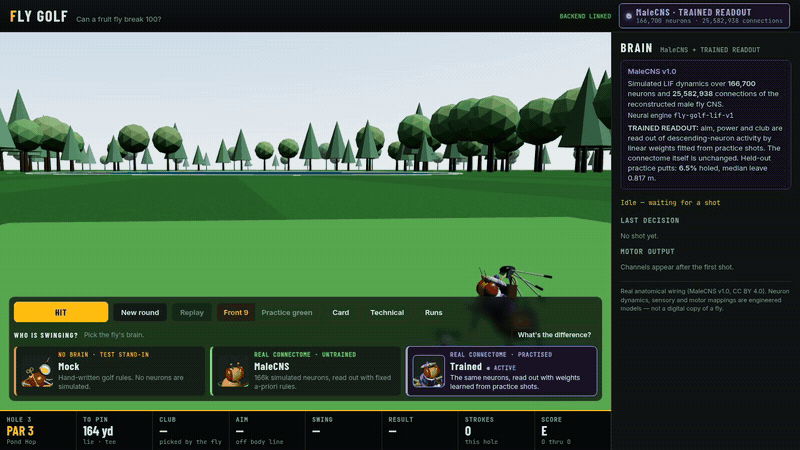](docs/media/trained-pond-hop-gameplay.mp4)

*One real shot on Pond Hop, the 164-yard third. The trained readout runs 400 ms of MaleCNS
activity, chooses the 4-hybrid, and sends it over the pond while the telemetry and follow camera
tell the story. [Open the 1280×720 MP4](docs/media/trained-pond-hop-gameplay.mp4).*

> **What is real, and what is not**
>
> - **Real:** the MaleCNS v1.0 anatomical wiring. 166,700 neurons and 25,582,938 connections
>   from the brain and ventral nerve cord of one male fly (CC BY 4.0).
> - **Modelled:** the neural dynamics. A leaky integrate-and-fire engine implements the
>   whole-brain model of Shiu et al. 2024 and reproduces its Brian2 reference spike for spike
>   ([LIF_ENGINE.md](docs/LIF_ENGINE.md)).
> - **Engineered:** the golf sensory mapping (which neurons receive golf information) and the
>   golf motor mapping (which neurons become the swing), plus the golf physics. All are
>   documented.
> - **Trained:** an optional readout that learns, offline, to turn descending-neuron activity
>   into putt-or-swing, club, aim and power. **The connectome never learns.** This is not
>   synaptic plasticity inside MaleCNS ([TRAINING.md](docs/TRAINING.md)).
> - This is **not a digital copy of a fly's mind**, and no fly understands golf. It is simulated
>   neural dynamics operating over a real wiring diagram, wired to golf by hand.

## The web demo

[**jameskbb.github.io/fly-golf**](https://jameskbb.github.io/fly-golf/) is the same 3D app
replaying **recorded MaleCNS rounds**. The neural simulation was computed beforehand; the replay
runs entirely in your browser. There is no backend, and nothing is simulated or invented on the
page. Pick a brain, play its round one shot at a time, pause, scrub through a swing, jump to any
hole or stroke, orbit the camera, and read each shot's recorded spikes, active neurons,
population rates, motor channels and club choice. To watch the brain play new shots as they are
computed, [run it locally](#run-it-locally): the connectome download needs more than 1 GB of disk.

All three rounds were played from round seed 7, the project's default, chosen before any round
was played. None was picked from several attempts:

| Round | Brain | Score | What happened |
| --- | --- | --- | --- |
| **Trained MaleCNS: Front Nine** (featured) | the connectome + a trained readout | **58** (+22), 7 of 9 holes holed | Drivers off the tee, wedges around the greens, one ball in the water; two holes picked up |
| **Untrained MaleCNS: Front Nine** | the connectome, fixed readout rules | **81** (+45), no hole finished | Only a 6-, 7- or 8-iron from everywhere, and 29 penalty strokes |
| **Mock: Front Nine** | no brain: hand-written golf rules | **35** (−1) | The no-neuron reference. It reads the distance and lie directly, so it plays well |

[](https://jameskbb.github.io/fly-golf/)

On an 18-hole pace the two connectome rounds are 116 and 162. **The fly does not break 100
yet.** The connectome rounds were recorded at this repository's first public commit, and every
round re-simulates bit for bit (`fly-golf replay`).
How the demo works and how to publish another run: [GITHUB_PAGES.md](docs/GITHUB_PAGES.md).

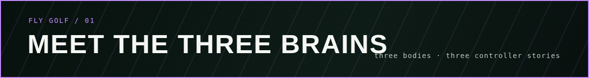

## Meet the three brains

The full-body 3D renders below are the same procedural models used on the course. They share one
animated rig, but their bodies tell the scientific story: the wind-up toy has no brain, the plain
fly uses the untrained connectome, and the dressed golfer uses that same connectome with a practised
readout. The costumes are visual metaphors, not biological claims.

### Mock — the wind-up

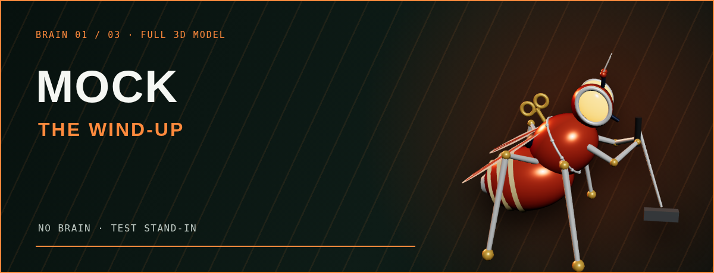

**No brain · test stand-in.** Mock is a small, hand-written golf heuristic with seeded noise and a
caddie's distance table. It reads the distance, slope and lie directly, chooses a club and hits the
shot. No neurons or connectome are simulated. The clockwork body makes that impossible to mistake:
it does exactly what its rules wind it up to do. Mock exists to test the course, physics, animation
and recording—and to provide a strong no-brain reference.

### MaleCNS — the wild fly

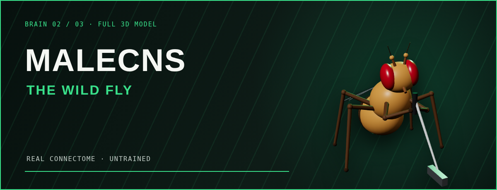

**Real connectome · untrained.** Each shot runs 400 ms of simulated LIF dynamics across all 166,700
neurons and 25,582,938 connections in MaleCNS v1.0. Engineered sensory channels stimulate chosen
visual and gravity-sensing populations; fixed, a-priori rules read descending-neuron activity into
club, aim, power, tempo and contact. The wild fly has never had a lesson, and it plays like it: the
current readout tends to reach for the same mid iron and does not finish holes.

### Trained — the trained golfer

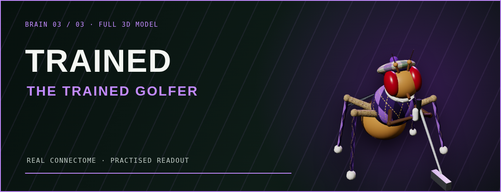

**Real connectome · practised readout.** This is the same MaleCNS graph, neuron model, synapses and
sensory input as the wild fly. Nothing inside the connectome learns. Offline practice fits linear
weights that turn roughly 480 descending-neuron-type firing rates into a putt-or-swing decision,
club, aim and power; the tam, argyle, plus-fours and glove make that external practice visible. It
now finishes many holes, but the honest control result is that a readout of the raw senses—and a
degree-preserving shuffled connectome—still plays better. The full method and results are in
[TRAINING.md](docs/TRAINING.md).

You can switch brains at any time, even mid-hole. The next shot uses the new controller, every shot
record names it, and the scorecard marks which brain played each hole; a round involving more than
one is labelled **MIXED BRAINS**. The picker headshots and the on-course characters are rendered from
the same procedural 3D models.

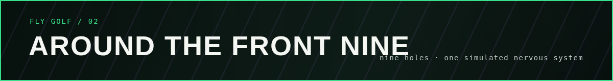

## Around the front nine

Nine hand-built holes, 3,352 yards and par 36. These north-up renders come from the course itself,
so every stripe, bunker, water line, green and tree boundary matches the geometry used by the
physics. The front nine stays the front nine; the back nine is the graduation round once the model
can play this side a little more convincingly.

<details>
<summary><strong>Open the full front-nine yardage book</strong> · bird's-eye renders and strategy for all nine holes</summary>
<br>
<table>
<tr>
<td width="33%">
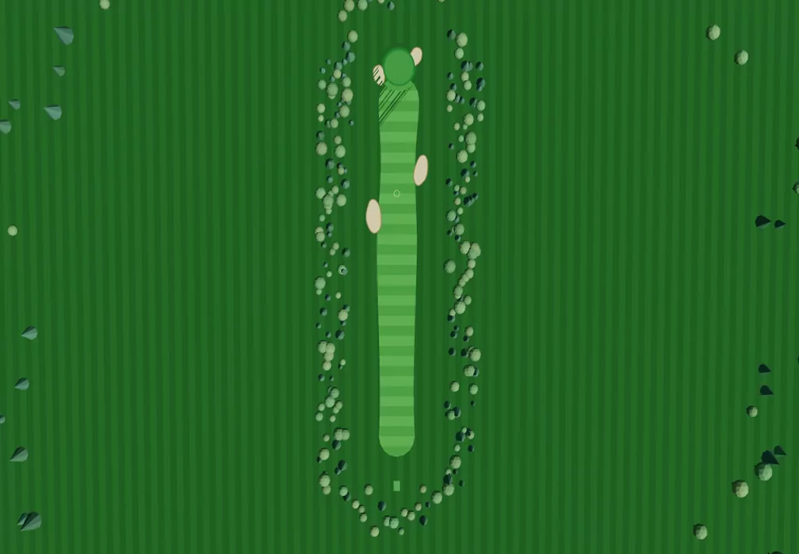<br>
<strong>1 · First Flight</strong><br>
Par 4 · 364 yd<br>
Fairway bunkers pinch the landing area; two more guard the green.
</td>
<td width="33%">
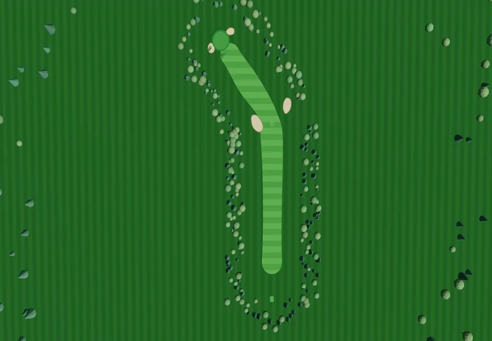<br>
<strong>2 · The Dogleg</strong><br>
Par 4 · 412 yd<br>
A hard turn left around the corner bunker rewards position over power.
</td>
<td width="33%">
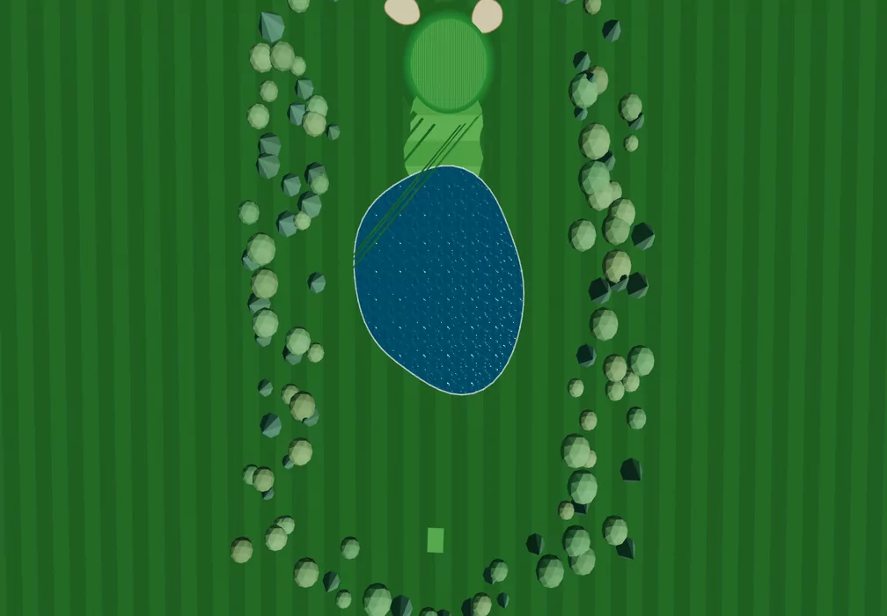<br>
<strong>3 · Pond Hop</strong><br>
Par 3 · 164 yd<br>
All carry over the pond to a green that tilts back toward the water.
</td>
</tr>
<tr>
<td width="33%">
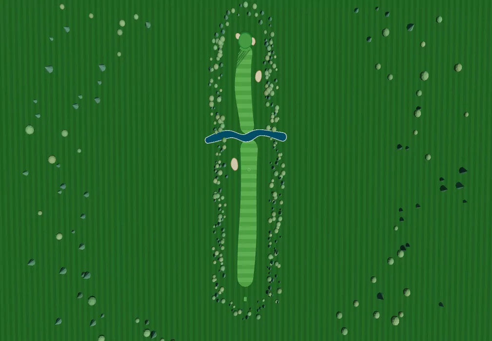<br>
<strong>4 · Long Haul</strong><br>
Par 5 · 523 yd<br>
A creek crosses just past driving distance: lay up, or commit to the carry.
</td>
<td width="33%">
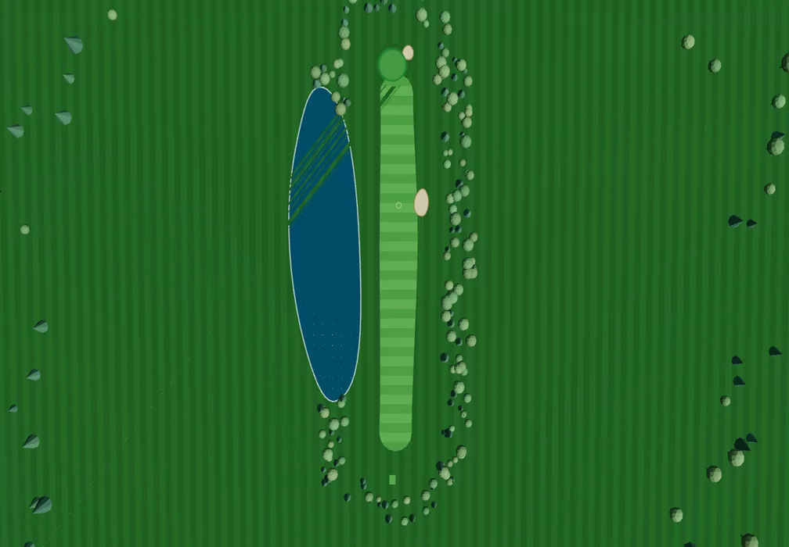<br>
<strong>5 · Lakeside</strong><br>
Par 4 · 379 yd<br>
The lake owns the entire left side, and the green leans toward it.
</td>
<td width="33%">
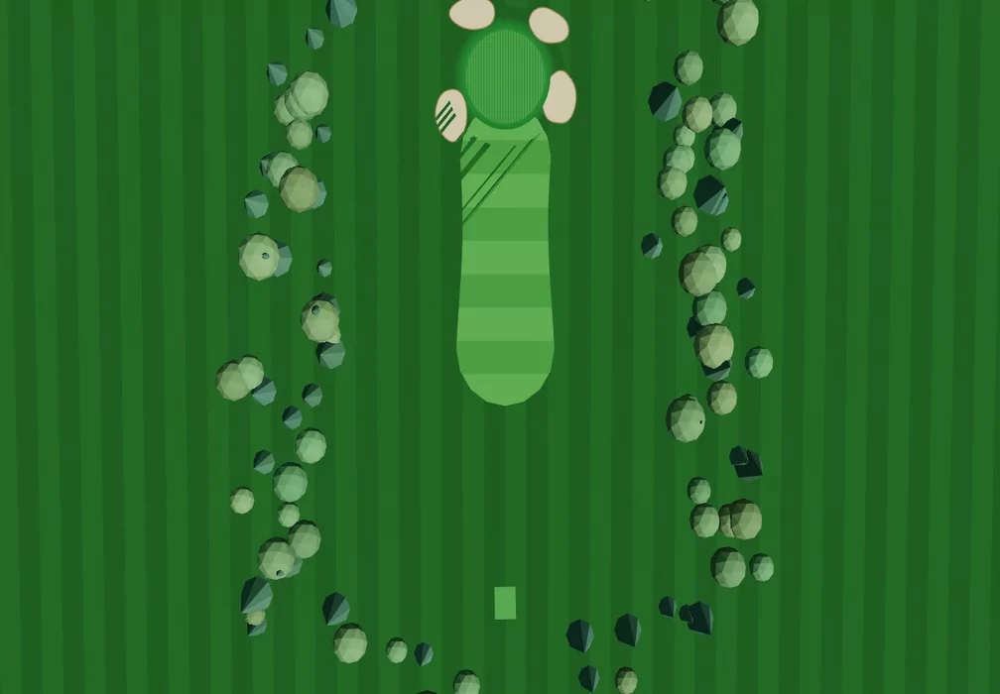<br>
<strong>6 · Little Sting</strong><br>
Par 3 · 137 yd<br>
Short on the card, but its small green is ringed by four bunkers.
</td>
</tr>
<tr>
<td width="33%">
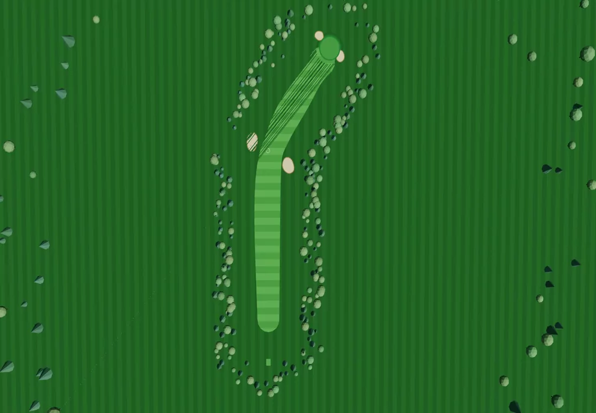<br>
<strong>7 · Wingspan</strong><br>
Par 4 · 423 yd<br>
A long dogleg right with sand waiting on the inside corner.
</td>
<td width="33%">
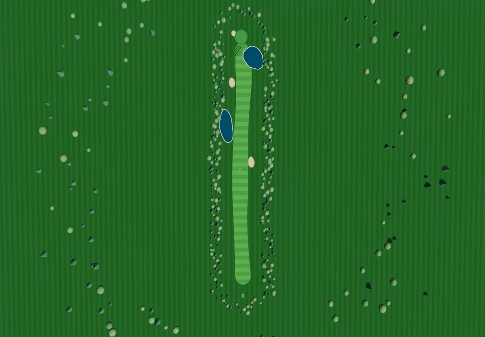<br>
<strong>8 · Marsh Run</strong><br>
Par 5 · 553 yd<br>
A marsh pond splits the fairway; a second water hazard guards short-right.
</td>
<td width="33%">
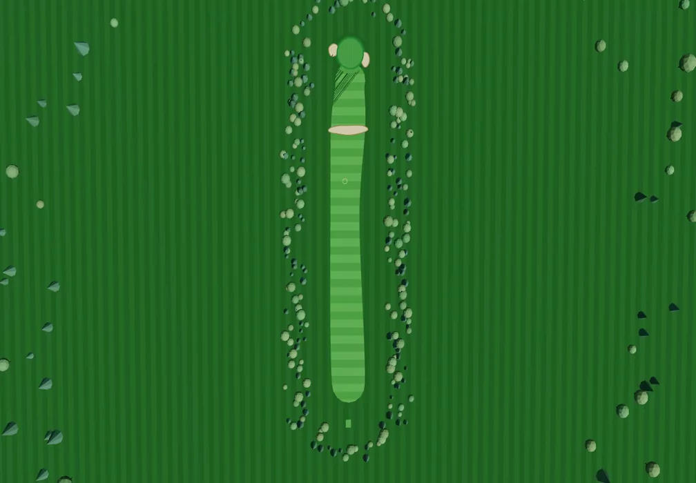<br>
<strong>9 · Home Stretch</strong><br>
Par 4 · 396 yd<br>
A cross bunker divides the fairway before a big, fast finishing green.
</td>
</tr>
</table>
</details>

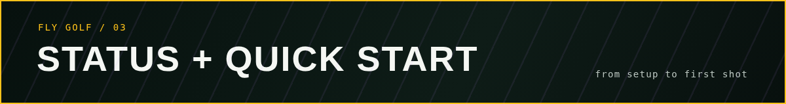

## Status

| | |
| --- | --- |
| **Front nine**: 9 hand-designed holes, fairways, bunkers, water on holes 3/4/5/8, tree-lined out of bounds ([COURSE.md](docs/COURSE.md)) | ✅ |
| **Full bag**: driver, 3W, 5W, 4H, 5–9 irons, PW/GW/SW/LW, putter. The fly chooses via the `club_reach` motor channel | ✅ |
| Full-shot physics: drag + Magnus flight, spin, surface bounce and roll, penalties, lies | ✅ tested, replayable |
| **Trained readout v2** of MaleCNS descending-neuron activity (putter gate, club head, aim/power heads, calibrated by practice), with no-brain and shuffled controls; retrained on the Brian2-exact engine: 70.0 strokes per nine, half the holes holed ([TRAINING.md](docs/TRAINING.md#engine-migration-2026-09-13)) | ✅ experimental |
| **Switch brains mid-round** (Mock / MaleCNS / Trained); scorecard marks who played each hole, mixed rounds flagged | ✅ |
| **Web demo**: Showcase Mode replays recorded MaleCNS rounds on GitHub Pages, no backend ([GITHUB_PAGES.md](docs/GITHUB_PAGES.md)) | ✅ |
| `fly-golf bench`: complete front-nine rounds per brain (holes finished, strokes, trees, club by distance) | ✅ |
| Deterministic, backend-authoritative putting physics (slope, stimp, cup capture, lip-outs) | ✅ tested |
| Controller interface: SensoryEncoder → BrainController → MotorDecoder → MotorTarget | ✅ |
| **MOCK CONTROLLER** (hand-written heuristic, labelled everywhere) | ✅ |
| **MaleCNS controller**: full-graph LIF simulation (`fly-golf-lif-v1`, Brian2-exact), proxy sensory input, descending-neuron readout | ✅ ~1.2 s of compute per 400 ms decision |
| 3D course, procedural fruit fly golfer, swing animation driven by decoded motor output | ✅ |
| Live WebSocket telemetry, brain panel, technical panel, run history, deterministic replay | ✅ |
| **A body per brain**: Mock plays as a clockwork tin fly (no neurons inside), MaleCNS as the plain fly, Trained as the same fly in golf clothes | ✅ |
| Experiment records (JSONL) with git commit, seeds, versions, neural summary and trajectory | ✅ |
| **Does the connectome play well?** | ❌ Not yet. The untrained readout hits a mid iron from everywhere and never finishes a hole. The v2 **trained readout** picks wedges around the green, putts every green shot and finishes a large share of holes, but a readout of the raw senses plays far better, and **a degree-preserving shuffled connectome trains better than the real one**. See [TRAINING.md](docs/TRAINING.md#results) |

## Run it locally

Requirements: [uv](https://docs.astral.sh/uv/), [pnpm](https://pnpm.io/) 10+, Node 22+. uv installs
Python 3.12 for you.

```sh
make setup      # uv sync + pnpm install
make dev        # backend http://127.0.0.1:8000  +  app http://localhost:5173
make test       # all unit tests (no connectome needed)
```

Open http://localhost:5173 and press **Hit** (or Space). The header reads **LIVE SIMULATION** while
the backend is connected. The app starts on the **front nine** with the **MOCK CONTROLLER**.
Switch to **Practice green** for seeded putts (putter only, recorded as `putting-v2` on v0.2
sensing; the original v0.1 putts replay with `fly-golf replay`), click a hole number on the
scorecard to jump to it, and press **C** to hide the card.

To let the real connectome play:

```sh
make data       # downloads ~1.1 GB (public, CC BY 4.0), verifies SHA-256, compiles in ~10 s
```

Then choose **MaleCNS** or **Trained** in the brain picker. Details are in
[data/README.md](data/README.md). The full graph needs about 1 GB of RAM while it runs.

The web demo, locally and without a backend:

```sh
pnpm showcase                        # http://localhost:5173/fly-golf/
pnpm build:showcase && pnpm preview  # the exact GitHub Pages build at http://localhost:4173/fly-golf/
```

Headless, from the command line:

```sh
uv --directory services/sim run fly-golf round --controller mock --seed 7      # the front nine
uv --directory services/sim run fly-golf round --controller malecns --seed 7
uv --directory services/sim run fly-golf putt --controller malecns --seed 7 --traces
uv --directory services/sim run fly-golf train --scale 4 --seed 2 --jobs 12     # trained readout (docs/TRAINING.md)
uv --directory services/sim run fly-golf bench --controller malecns-trained    # complete front-nine rounds
uv --directory services/sim run fly-golf runs
uv --directory services/sim run fly-golf replay <run_id>     # re-simulate; checks the trajectory is identical
uv --directory services/sim run fly-golf export-showcase <run_id> --slug <id> --title "…"   # docs/GITHUB_PAGES.md
```

### Windows

Use the same commands through pnpm, so `make` is not required. In PowerShell:

```powershell
powershell -ExecutionPolicy ByPass -c "irm https://astral.sh/uv/install.ps1 | iex"   # uv
corepack enable; corepack prepare pnpm@latest --activate                            # pnpm
pnpm run setup
pnpm run dev
pnpm run test
pnpm run data        # optional: MaleCNS connectome
```

WSL2 also works exactly like Linux, and this project was developed on WSL2.

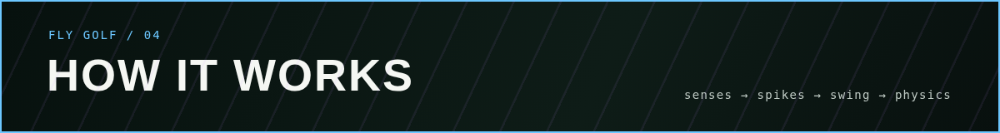

## How it works

This diagram shows what the code does today. The colours show what is **real data** (green),
**modelled** (blue), **engineered by us** (orange), **trained** (purple) and **test
infrastructure** (grey).

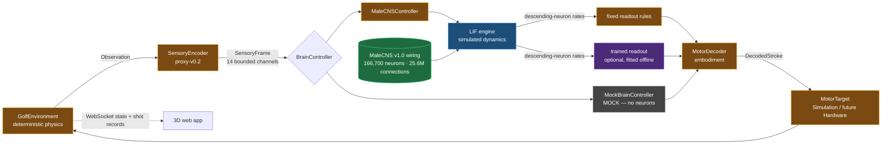

The loop runs **once per stroke**. The fly senses the scene, its brain simulates 400 ms, one
stroke comes out, and the ball flies and rolls. There is no arrow back into the brain: the reward
is recorded for analysis but never fed to the brain, and the neural state is reset to rest before
every stroke. The only learning is the optional readout, fitted offline, outside the connectome.

The same app runs in two modes ([ARCHITECTURE.md](docs/ARCHITECTURE.md)): **live**, driven by the
FastAPI + WebSocket backend above, and **showcase**, which replays exported shot records as static
files on GitHub Pages.

```
apps/web            React + three.js (R3F) app: course, fly, brain panel, replay; live and showcase builds
packages/protocol   Typed wire protocol and showcase format (zod) + shared JSON fixtures, checked from both sides
services/sim        Python backend (FastAPI, NumPy, Numba)
  fly_golf/golf         physics, course, clubs, environments
  fly_golf/brain        interfaces, sensory, mock, motor, registry, trained readout
  fly_golf/brain/malecns  engine.py (LIF), graph.py, populations.py, controller.py
  fly_golf/experiments  runner.py (sessions, JSONL records, replay), bench, showcase exporter
  fly_golf/training     the trained-readout pipeline
  fly_golf/data         prepare.py + compiler.py (make data)
  fly_golf/api          app.py (REST + WS), schemas.py
data/               lock file + README; downloads/compiled graph are git-ignored
docs/               architecture, provenance, mappings, training, course, build log
runs/               experiment records (git-ignored)
```

**One stroke, step by step:**

1. The backend knows the hole, the ball, the lie and the target.
2. The proxy encoder turns the golf state into perceptual channels: where the target is, how far
   away, which way the ground falls, how fast the green is, the lie and whether water is on the
   line. It never provides an aim angle, a club or a stroke power.
3. In MaleCNS mode, those channels become constant current into documented sensory populations,
   such as LC10 visual-target neurons and Johnston's organ gravity neurons.
4. The network runs for 400 ms of neural time. Every retained neuron and connection takes part.
5. Descending-neuron activity is read out: by fixed a-priori rules, or by the optional trained
   readout. It becomes eight motor channels, including `club_reach`, the club the fly reaches for.
6. The shared decoder turns those channels into a club, a start direction and a ball launch, and
   the physics flies and rolls the ball.
7. The 3D fly pulls that club from its bag and animates the decoded stroke; the ball follows the
   backend trajectory.
8. Everything is recorded. `fly-golf replay <run> --controller` re-simulates each trajectory and
   re-runs the controller on the recorded sensory frame, and both must match exactly.

> **Honest caveat about aim:** the fly addresses the ball within ±10° of the target line, so most of
> a shot's direction comes from the embodiment. See
> [MOTOR_MAPPING.md](docs/MOTOR_MAPPING.md#first-connectome-putt-2026-09-13-result).

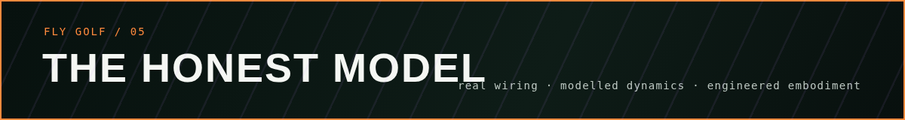

## Scientific caveats

**Is this a digital fly?** Short answer: **no.** We have a real fly's *wiring diagram*. We run a
*simplified simulation* of electricity flowing through it. We *choose* where golf information goes
in and where the stroke comes out.

An analogy: imagine you had a perfect map of every road in a city, including every lane and
every intersection. That map is real and hard-won. Now you simulate traffic on it using a few
simple rules: cars go, cars stop, cars turn. Traffic really does flow along the real roads, and
the map shapes where it goes. But it is not the city. There are no drivers with destinations, no
traffic lights with real timing, no weather. And **you** decide where cars enter the map and
which exits you count as "the answer".

Fly Golf is that, for a fly's nervous system:

| Layer | What we use | Status | What it means |
| --- | --- | --- | --- |
| **Wiring**: which neuron connects to which, and how many synapses | MaleCNS v1.0: 166,700 neurons and 25.6M connections, reconstructed from electron microscopy of one male fly | ✅ **Real data** | This is the scientifically valuable part. We keep every connection and prune nothing. |
| **Excitatory or inhibitory** | Predicted from the neurotransmitter each neuron is likely to use (from the dataset) | 🟦 **Inferred** | A good estimate, but some cells are ambiguous; those default to excitatory. |
| **Synapse strength** | Synapse count × 0.275 mV | 🟦 **Modelled** | A real synapse's strength depends on receptors, location and chemistry. We use one number for all. |
| **How a neuron behaves** | "Leaky integrate-and-fire": charge builds up, the neuron fires, it resets. The same rules for every cell | 🟦 **Modelled** | Real neurons are far richer: ion channels, graded signals, neuromodulators such as dopamine, gap junctions. None of that is simulated. |
| **Senses** | Golf facts ("target is 3° left, 150 m away, ground falls left, water on the line") turned into current injected into visual-target cells (LC10) and gravity-sensing antenna cells (Johnston's organ) | 🟧 **Engineered** | The fly does not *see* the course. We hand its brain a signal, in neurons we chose. |
| **Body and muscles** | Firing of descending neurons (brain → body) is read out and turned into club, aim, power, tempo and strike | 🟧 **Engineered** | Real flies don't swing golf clubs. We chose which neurons count as "the stroke". The 3D swing is a visualisation of that readout. |
| **Where the fly stands** | The fly is placed roughly facing the target (±10°) | 🟧 **Engineered** | Most of a shot's direction comes from this placement, not from neurons. See [MOTOR_MAPPING.md](docs/MOTOR_MAPPING.md). |
| **Trained readout** (optional) | Linear weights fitted offline on descending-neuron rates from practice shots | 🟪 **Trained** | Learning happens *outside* the connectome. It is not synaptic plasticity: MaleCNS is never changed. |
| **Memory and learning inside the brain** | None. Brain state resets before every stroke | ❌ **Not present** | The connectome cannot improve or remember the last shot. |
| **Physics** | Deterministic ball flight, bounce and roll: slope, green speed, cup capture, lies, hazards | 🟧 **Engineered** | A simplified but calibrated golf model (see [PROVENANCE.md](docs/PROVENANCE.md) and [COURSE.md](docs/COURSE.md)). |
| **The web demo** | Shot records exported from real runs | 📼 **Recorded** | The browser replays what the simulator computed earlier. It simulates nothing. |

**So what *is* the connectome contributing?** Everything between "current goes into the sensory
neurons" and "descending neurons fire" is determined by the real wiring: which of the roughly
10,000–20,000 neurons that activate on each shot light up, how strongly, and in what order. That is
the part nobody hand-wrote. It is also why the results are honest and currently unimpressive: with
our first choice of inputs and outputs, the real wiring does not yet turn "the hole is close" into
"hit it softly", and a shuffled connectome trains a better readout than the real one.

**What would make it more fly-like?** In rough order of scientific value:

1. **Controls.** Lesions of the chosen populations, alongside the shuffled-wiring control that
   already exists ([TRAINING.md](docs/TRAINING.md#controls-and-baselines)).
2. **Real vision.** Render the course through modelled fly eyes and drive the photoreceptors,
   instead of injecting summary numbers.
3. **Richer neurons.** Graded signalling in the visual system, and neuromodulation.
4. **Learning.** Plasticity rules, labelled experimental and tested against those controls.

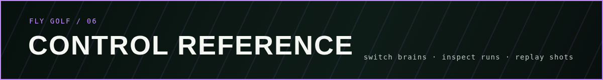

## Controller reference

| In the app | Controller id | Neural simulation | Readout |
| --- | --- | --- | --- |
| **Mock** (orange) | `mock` | none | hand-written golf heuristic |
| **MaleCNS** (green) | `malecns` | full MaleCNS v1.0, 400 ms per shot | fixed, a-priori rules |
| **Trained** (purple) | `malecns-trained` | the same MaleCNS simulation | weights fitted offline from practice |

The [visual guide above](#meet-the-three-brains) explains what each mode does and why it has its
particular body. **What's the difference?** in the app (key `M`) opens the same comparison alongside
the installed readout's training and benchmark numbers.

If the connectome is not compiled, MaleCNS is disabled and the UI shows the fix command. The app
never silently falls back to the mock.

## API

`GET /health` · `GET /api/status` · `GET /api/course` · `POST /api/session {controller, mode, seed?}` ·
`POST /api/controller {controller}` (swap the brain mid-round) · `POST /api/reset {seed?, hole?}` · `POST /api/next` · `POST /api/shot` (alias `/api/putt`) · `GET /api/runs` ·
`GET /api/runs/{id}` · `GET /api/runs/{id}/shots/{shot}/replay` · `WS /ws/simulation`, which does a versioned
hello (protocol v2) and then streams `state`, `shot_phase`, `shot_result` and `controller_status`.

## Testing

- **Backend:** `make test` runs about 300 tests without the connectome, and the real-data
  integration tests when it is compiled. They cover physics invariants (rest, friction, stimp
  calibration, determinism, cup capture, slope break), the course and full-shot physics,
  controllers (determinism, bounds, malformed input), the runner and replay, the LIF engine and
  its Brian2 parity, the MaleCNS adapter on a synthetic graph, training, the API and WebSocket,
  the showcase exporter, and the protocol fixtures.
- **Integration:** `make test-integration` adds the real-connectome tests. They auto-skip without
  data.
- **Frontend:** protocol contract tests, including that the version matches the backend; swing
  timeline and terrain tests; and showcase tests that validate every committed showcase file and
  rebuild each round's scorecard from its shots.
- **CI:** `.github/workflows/ci.yml` runs lint, tests, both builds and a real server smoke test.
  It never downloads the connectome. `.github/workflows/pages.yml` deploys the web demo.

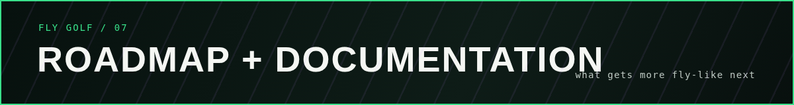

## Roadmap

Done: putting, the front nine, club selection, full swings, hazards, the trained readout with its
controls, and the web demo. Next:

1. **Controls:** lesion experiments, and more rounds per brain on shared seeds.
2. **Showcase comparisons:** first putt, before and after training, the shuffled-connectome
   control, and the best round, side by side on the web demo.
3. **Vision:** render the course through modelled fly eyes and drive the photoreceptors (see
   [SENSORY_MAPPING.md](docs/SENSORY_MAPPING.md)).
4. **Career:** handicap, greens in regulation, putts and dispersion. Meet *Gary, Drosophila
   melanogaster, 166,700 neurons.*
5. **Physical world:** a `HardwareMotorTarget` for a robotic putter.
6. **Graduate to 18 holes:** build the back nine once the model can reliably finish the front.

## Documentation

- [docs/ARCHITECTURE.md](docs/ARCHITECTURE.md): live and showcase modes, the data flow and the code
  layout.
- [docs/GITHUB_PAGES.md](docs/GITHUB_PAGES.md): the web demo, deployment, and exporting a new
  showcase run.
- [docs/LIF_ENGINE.md](docs/LIF_ENGINE.md): the neural engine, the model it implements, and how it
  is validated against the Brian2 reference.
- [docs/UPSTREAM.md](docs/UPSTREAM.md): the upstream projects inspected, their commits, and what
  was reused then and now; [docs/DOOMFLY_DECOUPLING_AUDIT.md](docs/DOOMFLY_DECOUPLING_AUDIT.md):
  how Fly Golf's data and neural stack became its own.
- [docs/PROVENANCE.md](docs/PROVENANCE.md): the dataset, simulator lineage, and all model and
  physics assumptions.
- [docs/SENSORY_MAPPING.md](docs/SENSORY_MAPPING.md) and
  [docs/MOTOR_MAPPING.md](docs/MOTOR_MAPPING.md): exactly which neurons are used, and why.
- [docs/COURSE.md](docs/COURSE.md): the front nine, the bag, full-shot physics and rules.
- [docs/TRAINING.md](docs/TRAINING.md): the trained readout, its controls and results.
- [docs/BUILD_LOG.md](docs/BUILD_LOG.md): decisions, what works, what failed, and next steps.
- [docs/PUBLIC_RELEASE_AUDIT.md](docs/PUBLIC_RELEASE_AUDIT.md): what was checked, and left out,
  before this repository was published.
- [data/README.md](data/README.md): connectome setup.

## Attribution

- **Connectome:** MaleCNS v1.0 © the MaleCNS collaboration (FlyEM/HHMI Janelia, Cambridge, MRC
  LMB, Google Research), CC BY 4.0. Cite https://doi.org/10.1016/j.cell.2026.08.015. No
  connectome data is stored in this repository; `make data` fetches it from the official release.
- **Neural model:** the whole-brain LIF model of Shiu *et al.* 2024 (reference implementation MIT).
  Fly Golf's engine, data compiler and source lock are implemented in this repository.
- **History:** early versions of Fly Golf used portions of the open-source
  [DOOMFLY](https://github.com/nftechie/doomfly) MaleCNS simulation (MIT). Its adapted LIF kernel
  is kept, unused for new shots, only to replay older records and run readouts trained on it
  ([UPSTREAM.md](docs/UPSTREAM.md)).
- **Licenses:** full notices are in [THIRD_PARTY_NOTICES.md](THIRD_PARTY_NOTICES.md). Fly Golf's
  own code is MIT.

This repository is Fly Golf's public home and the place for new work. The project was incubated
in a private repository; that history was not carried over, so this repository starts at the
first public release.
