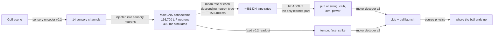
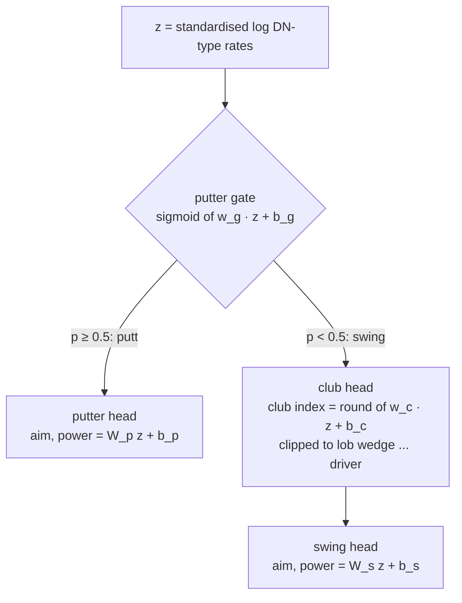

# Training the fly (a trained readout, not a trained brain)

> **What is trained, and what is not.** The MaleCNS connectome, its synaptic weights and the LIF
> dynamics are never changed. What is learned is a **readout**: weights that turn the firing
> rates of the brain's descending neurons into the stroke: putt or swing, which club, where to aim
> and how hard. This is reservoir-style learning on top of a fixed network. The controller that
> uses it is called `malecns-trained` and is labelled **TRAINED** everywhere (header badge, brain
> picker, scorecard, run records).

This page is the complete description of how the trained readout is made, why it is made that
way, what it achieves and what it does not. Everything here is reproducible from the commands at
the end.

- [The three brains](#the-three-brains)
- [The problem training has to solve](#the-problem-training-has-to-solve)
- [Method (v2, `hindsight-gated-v2`)](#method-v2-hindsight-gated-v2)
- [What went wrong in v1, and what v2 changes](#what-went-wrong-in-v1-and-what-v2-changes)
- [Controls and baselines](#controls-and-baselines)
- [Results](#results)
- [Engine migration (2026-09-13)](#engine-migration-2026-09-13)
- [Readout capacity and side-resolved features (2026-09-14)](#readout-capacity-and-side-resolved-features-2026-09-14)
- [Sensory injection v0.3 (2026-09-17)](#sensory-injection-v03-2026-09-17)
- [The back nine is held out (2026-09-27)](#the-back-nine-is-held-out-2026-09-27)
- [Honest limits](#honest-limits)
- [Reproduce](#reproduce)

## The three brains

| In the app | Controller id | Stroke comes from | Neural? |
| --- | --- | --- | --- |
| **Mock** (orange) | `mock` | a few lines of hand-written golf rules, like a caddie table | **no** |
| **MaleCNS** (green) | `malecns` | MaleCNS connectome simulation, read out by fixed a-priori rules (`MOTOR_MAPPING.md`) | yes |
| **Trained** (purple) | `malecns-trained` | the same simulation, read out by weights learned from practice (this page) | yes |

The brain can be switched at any moment, even mid-hole (`POST /api/controller`). The next shot is
played by the new brain; every shot record names the brain that played it, each scorecard hole
lists every brain that played a stroke on it, and a round with more than one brain is shown as
**MIXED BRAINS** and never reported as any single brain's score.

## The problem training has to solve

For every shot the same thing happens in play and in training:


```mermaid
flowchart LR
  A[Golf scene] -->|sensory encoder v0.2| B[14 sensory channels]
  B -->|injected into sensory neurons| C[MaleCNS connectome\n166,700 LIF neurons\n400 ms simulated]
  C -->|mean rate of each\ndescending-neuron type\n150-400 ms| D[~481 DN-type rates]
  D -->|READOUT\nthe only learned part| E[putt or swing, club,\naim, power]
  C -->|fixed v0.2 readout| F[tempo, face, strike]
  E & F -->|motor decoder v2| G[club + ball launch]
  G -->|course physics| H[where the ball ends up]
```

The readout sees **only** the descending-neuron (DN) rates: never the distance, the lie, the cup
or any other golf state. If the fly chooses a wedge from 40 m, it is because the activity the
scene evoked in its descending neurons carries that information and the learned weights read it.

## Method (v2, `hindsight-gated-v2`)

Code: `services/sim/src/fly_golf/training/` (`pipeline.py`, `situations.py`) and
`brain/trained.py`.

### 1. Practice situations (`practice-situations-v2`)

A seeded, deterministic set of places to play from. Per `--scale 1`:

| Kind | Count | What |
| --- | --- | --- |
| `putt` | 120 | practice-green putts, 1–6 m (the V1 putting generator) |
| `green` | 120 | putts on the nine front-nine greens, 1–14 m |
| `short` | 120 | **new in v2**: chips and pitches from 3–70 m around the greens (rough, fairway, sand, fringe) |
| `full` | 200 | tee shots and shots along each hole from fairway, rough or sand |

Every situation whose index ends in 1, 4 or 7 (30 %) is **held out**: it is never used for fitting
or for choosing any setting, and all reported results are on those.

Every course situation (`green`, `short`, `full`) is on the **front nine** (holes 1-9). The back
nine, added on 2026-09-27, is held out as a whole: no practice situation is on it
([below](#the-back-nine-is-held-out-2026-09-27)).

### 2. The neural response

For each situation the scene's sensory frame is injected into the connectome exactly as in play,
400 ms of dynamics are simulated from rest, and the feature vector is the mean firing rate of
every DN type in the 150–400 ms readout window. The fixed v0.2 readout's tempo, face and strike are
recorded too (the fly keeps its own untrained tempo and face; only club, aim and power are learned).

### 3. Practice by trial and error (the targets)

The readout needs to know what a good stroke *would have been* from each spot. There is no teacher
and no analytic golf solution: the fly "practises" in the physics simulator.

- **Putts** (green or fringe): a 41 aim × 31 power grid, then an 11 × 11 refinement, all with the
  putter. The grid is smoothed (each cell averaged with its neighbours) before taking the best, so
  the target sits in the middle of a region that works rather than on a lucky edge.
- **Full shots, chips and pitches**: every one of the 14 clubs × 11 swing lengths × 9 aims within
  ±10° of where the fly faces (it addresses its target within ±6°). For each club the grid is
  smoothed the same way, which gives that club's **robust score**: a stroke that only works if it is
  perfect, with the trees or the water a hair away, scores badly because its neighbours do.
  Then the **least club that gets there**: among all clubs whose robust score is within
  max(2 m, 4 % of the distance to the pin) of the best club's, the shortest one is chosen, and its
  aim and swing length are refined.

The score of a stroke is `-(metres from the pin where it stops) - 25 m per penalty stroke`
(holed = +1). Only simulated outcomes are used.

### 4. The readout (`fly-golf-gated-readout-v2`)

All parts read the same input: `z = standardise(log(1 + DN-type rates))`.


```mermaid
flowchart TB
  Z[z = standardised log DN-type rates] --> G{putter gate\nsigmoid of w_g · z + b_g}
  G -->|p ≥ 0.5: putt| P[putter head\naim, power = W_p z + b_p]
  G -->|p < 0.5: swing| C[club head\nclub index = round of w_c · z + b_c\nclipped to lob wedge ... driver]
  C --> S[swing head\naim, power = W_s z + b_s]
```

- **Putter gate**: logistic regression (putt or swing?), fitted by Newton's method.
- **Club head**: ridge regression onto the club's position in the bag (1 = lob wedge … 13 =
  driver), fitted on swing situations only, rounded to the nearest club.
- **Aim / power heads**: two ridge regressions, one on putts and one on swings, because a putter's
  power and a full swing's power mean different things.

Each part is a PCA projection followed by the regression; the number of PCA components (4–256) and
the regularisation are chosen by 5-fold cross-validation on the training situations only, and the
result is collapsed to a single linear layer on `z`. The readout is saved as JSON with full
provenance (git commit, versions, graph, seeds, CV choices, held-out metrics, bench results) and
evaluated exactly as saved.

### 5. Calibration by practice

A regression that is unsure predicts the middle: short shots come out a club or two too long and
long shots too short. On a golf course those errors are not symmetric: a wedge that is a club too
long flies the green into the trees (a penalty stroke, replay from the same spot), a club too short
just leaves another shot. So after the fit the fly practises **with its own readout**: on the
training situations only, it plays the stroke the readout decodes and the physics scores it. Four
numbers about how the outputs are decoded are chosen to maximise that practice score:

- `club_stretch` (1–3): stretches the club head's output about its mean, undoing the shrinkage;
- `club_shift` (−1 to +2.5 clubs): a positive shift takes the shorter club;
- `power_scale` for the putter head and for the swing head (0.8–1.1).

The grid always includes "no change", so calibration can only improve the pooled practice score;
the held-out situations are never used, and the readout still reads nothing but its input vector.

A pooled score can hide a trade-off: in the first pilot the calibration that saved many chips
from the trees made held-out full shots worse (median leave 52 m → 64 m), which only showed up
because the pilot without calibration had been kept. So (review fix) a setting is **only allowed if
no kind of shot (putt, green, short, full) gets more than 1 m worse in practice** than with no
calibration; the practice score before and after is stored **per kind**, settings that land on the
edge of their grid are flagged, and the held-out evaluation always reports the **uncalibrated**
readout next to the calibrated one (`trained_readout_uncalibrated`, `no_brain_uncalibrated`).

### 6. Evaluation

- **Held-out shots**: one stroke per held-out situation, real physics, per kind: holed %, median
  distance left, penalty %, **into the trees %**, and the club chosen compared with the practice
  target (exact, within one club).
- **Complete rounds** (`fly-golf bench`): the fly plays whole rounds exactly as in the
  app (same session code, sensing, brain, decoder and physics), every shot from wherever the last
  one finished, until it holes out or picks up at par + 5. Reported: strokes per round, holes holed
  out, trees and water per round, and which club it reaches for at each distance. Until
  2026-09-27 a round was the front nine (par 36), and every bench result on this page before the
  [back-nine section](#the-back-nine-is-held-out-2026-09-27) is a front-nine round. Since then a
  bench round is 18 holes by default, with front- and back-nine splits; `--nine front` plays the
  front nine exactly as before.

## What went wrong in v1, and what v2 changes

v1 (`hindsight-ridge-v1`, readout `20260913T172347Z`) is what the user saw "grand-slamming it into
the trees" with a 5-iron from wedge range. Measured on its own training report:

1. **Contradictory targets.** Club and swing length trade off: a soft driver and a full wedge can
   finish in the same place, and v1's practice kept whichever was best by a hair. **88 of 180**
   held-out full-shot targets were the driver, the rest spread over every club.
2. **Regression to the middle of the bag.** One linear regression mapped DN rates to a single
   continuous `club_reach`. With contradictory targets it predicts their average: **76 of 180**
   held-out full shots came out as a 6-iron or 5-iron, usually near full power.
3. **Putter next to the lob wedge.** On the `club_reach` axis the putter (0.00) and the lob wedge
   (0.08) are neighbours, so small errors on the green chose a lob wedge (**26 %** of course-green
   putts).
4. **No short game.** Almost no practice came from 5–60 m, exactly where wedges are needed.
5. **No test of finishing holes.** One stroke per situation never showed that the fly could not
   get round.
6. **A fitting bug** (also fixed): PCA sizes were limited to {4, 8, 16, 32, 64} below the input
   width, so the 14-channel no-brain baseline could only ever use 4 or 8 directions.

v2's answers, in order: the least-club robust target; a gate and a club head instead of one
number; putts and swings on different heads behind a gate; the `short` situations; `fly-golf
bench`; and PCA choices that always include the full width.

## Controls and baselines

Same situations, same held-out split, same fitting code:

| Variant | What it is | What it tells us |
| --- | --- | --- |
| `fixed_v0.2_readout` | the untrained, a-priori readout (the MaleCNS brain in the app) | the starting point |
| `trained_readout` | DN-type rates → v2 readout (fitted, then calibrated by practice) | what training bought |
| `trained_readout_uncalibrated` | the same readout before step 5 | what calibration bought, per kind of shot |
| `no_brain_sensory_readout` | the identical v2 fit on the **14 sensory channels directly**, with a neutral stroke and its own practice targets | how much a readout of the raw senses can do; if the brain version is worse, the network (under this proxy injection) is losing information |
| shuffled connectome (`--control shuffled`) | the whole pipeline on a **degree-preserving shuffle**: each edge keeps its source neuron, sign and synapse count, targets are permuted (in- and out-degrees unchanged) | whether the *specific* MaleCNS wiring matters |
| `mock_heuristic` | the hand-written MOCK controller | a competent non-neural reference |
| `practice_best_upper_bound` | the practice target stroke itself | what a perfect readout could reach with the fly's own tempo and face |

## Results

### The runs

- **Final run** `20260913T194711Z` (`runs/training/v2-final-seed2-x6`), clean commit `bb3e690`:
  `--scale 6 --seed 2`, **3,360 practice situations** (720 practice putts, 720 course-green putts,
  720 chips and pitches, 1,200 full shots; 2.5× the 1,320 behind v1), 1,008 held out. 28 minutes on
  12 workers.
- **Out-of-fold refit** `20260913T200623Z-refit` (`runs/training/v2-final-seed2-x6-oof`), clean
  commit `6f3ea6d`: the same saved practice, re-fitted with the final code (calibration scored
  out of fold), `fly-golf refit`. This is the code at the head of the branch.
- **Shuffled-wiring control** `20260913T202752Z-shuffled` (`runs/training/v2-shuffled-seed2-x6`),
  clean commit `6f3ea6d`: the same pipeline, code and situations on the degree-preserving shuffle
  (every edge keeps its source neuron, sign and synapse count; targets permuted). Its readout is
  refused by `--install`: it is a control, not the fly.
- Pilots at scale 1 (560 situations) are kept in `runs/training/v2-pilot-seed2` and
  `v2cal-pilot-seed2` and summarised in BUILD_LOG.md.

### Held-out shots (one stroke per held-out situation, out-of-fold refit)

Holed %, median distance left, share into the trees, and (for chips and full shots) how often the
club is within one of the practice target's:

| Variant | Practice putts (n=216) | Course-green putts (n=216) | Chips and pitches (n=216) | Full shots (n=360) |
| --- | --- | --- | --- | --- |
| Fixed v0.2 readout (untrained MaleCNS) | 0 %, 5.91 m | 0 %, 6.77 m, **90 % trees** (it chips off the green with irons) | 0 %, 35.3 m, 83 % trees, club ±1 3 % | 0 %, 75.8 m, 19 % trees, club ±1 8 % |
| **Trained v2, calibrated (MaleCNS)** | **5.6 %, 0.84 m** | **3.7 %, 1.29 m, 0 % trees** | **0 %, 14.1 m, 8.8 % trees, club ±1 88 %** | 0 %, 78.2 m, 8.1 % trees, club ±1 55 % |
| Trained v2, uncalibrated | 4.6 %, 0.90 m | 3.2 %, 1.40 m, 0 % | 0 %, 16.9 m, 13.0 % trees, club ±1 62 % | 0 %, **62.0 m**, 5.0 % trees, club ±1 49 % |
| **Shuffled wiring, trained the same way (control)** | **16.2 %, 0.59 m** | **10.6 %, 2.69 m, 0 %** | **0 %, 9.7 m, 0 % trees, club ±1 97 %** | **0.3 %, 37.7 m, 1.4 % trees, club ±1 57 %** |
| No-brain (14 senses, same v2 fit) | 55.6 %, 0.00 m | 54.2 %, 0.00 m, 0 % | 1.9 %, 5.5 m, 0 %, club ±1 97 % | 0 %, 24.4 m, 0 %, club ±1 62 % |
| Mock heuristic | 35.6 %, 0.24 m | 18.5 %, 0.45 m | 0.9 %, 2.4 m | 0.3 %, 18.7 m |
| Practice best (upper bound) | 100 %, 0 m | 100 %, 0 m | 17 %, 0.49 m | 3.9 %, 6.7 m |

For comparison, v1 on its own (different) held-out set: practice putts 6.5 % / 1.01 m, green putts
2.8 % / 1.86 m with 4.6 % penalties, full shots 76.4 m with 16 % penalties, and no chips measured.

### Complete front-nine rounds (`fly-golf bench`, same round seeds 100–111)

| Brain | Rounds | Strokes per nine (par 36) | Holes holed out | Trees per round | Clubs from 20–60 m | Trees from 20–60 m |
| --- | --- | --- | --- | --- | --- | --- |
| Mock (hand-written, no brain) | 12 | 36.4 | 100 % | 0 | lob wedge | 0 % |
| MaleCNS, untrained readout | 12 | 81.0 (every hole picked up) | 0 % | 25.3 | 6-iron 94 % | 69 % |
| Trained **v1** (the one you played) | 8 | 79.0 | 8.3 % | 19.4 | 6i, 5i, 7i, 8i | 58 % |
| Trained v2, uncalibrated | 12 | 74.3 | 33.3 % | 11.7 | GW, PW, LW, SW | 48 % |
| Trained v2, calibrated (in-sample, `bb3e690`) | 12 | 72.0 | 43.5 % | 7.8 | **lob wedge 64 %** | 21 % |
| **Trained v2, calibrated out of fold (`6f3ea6d`, installed)** | 12 | **70.3** (best 61) | **50.0 %** | **7.0** | **lob wedge 65 %** | **17 %** |

A hole is "picked up" at par + 5 (docs/COURSE.md), so a nine can never exceed 81 strokes.

**Confirmation on fresh rounds.** The readout to install was chosen on seeds 100–111 above; to keep
that choice from flattering it, it was then played on 12 rounds it had never been chosen on (seeds
200–211): **71.5 strokes per nine** (best 60), **49.1 % of holes holed out**, **5.9 trees per
round**, lob wedge on 66 % of shots from 20–60 m. The selection did not flatter it. This summary is
stored in the installed readout's metadata (`meta.bench`, via `fly-golf bench --attach`) and shown
in the app's "What's the difference?" panel.

### What this says, honestly

- **The reported failure is fixed.** From 20–60 m v1 hit a 6-, 5- or 7-iron and 58 % of those shots
  went into the trees; v2 reaches for a lob wedge and far fewer chips leave the course (17 %). Trees
  per round fell from 19 to 7 and the fly now holes out on half of its holes instead of 1 in 12.
- **Putting from the course greens stopped being a disaster.** The untrained readout chips off the
  green with an iron 90 % of the time; the gate sends every green shot to the putter.
- **Calibration is a trade, and it is reported as one.** It makes chips much better and the median
  full shot worse (62 m → 78 m held out); in complete rounds the chips win (more holes finished,
  fewer trees), which is why a calibrated readout is the one installed: the out-of-fold refit
  `20260913T200623Z-refit`, which beat the in-sample calibration on the same rounds.
- **The brain is still the bottleneck.** The same fit on the 14 raw sensory channels putts 10×
  better and leaves full shots at 24 m instead of 78 m, and the hand-written mock goes round in
  36. Under this proxy injection the connectome's descending neurons carry the scene much less
  clearly than the senses that went in: even on its own training data the club head is off by
  about two clubs on average, and a bigger readout (up to 392 components) did not help.
- **The real wiring does not help; on this test it hurts.** The degree-preserving shuffle, trained
  on the same situations with the same code, beats the real MaleCNS connectome on every kind of
  shot: 16 % of practice putts holed against 6 %, chips 9.7 m against 14.1 m, full shots 38 m
  against 78 m, and its club head is off by 1.1 clubs on its training data against 2.0. The 1×
  pilot of v1 showed the same direction. So, under this proxy sensory injection and this
  descending-neuron readout, the reconstructed wiring passes the golf scene to the output layer
  *less usably* than random wiring with the same degrees. This is a real, reproducible result
  about this model, not about flies, and it is reported rather than hidden. (Caveat: each graph's
  targets are practised with its own untrained tempo / face / strike, so their ceilings differ;
  see each report's upper-bound row, e.g. 72 % vs 100 % of green putts. That does not explain a
  2× gap in full shots.) What the installed readout does is genuinely read the real connectome's
  activity, as the app claims; what this result says is that the real connectome is not yet an
  advantage.

## Engine migration (2026-09-13)

The neural engine changed from the DOOMFLY-adapted `lif-doomfly-r2-adapted-v1` (float32) to Fly
Golf's own `fly-golf-lif-v1`, which reproduces the Brian2 reference spike for spike on the full
graph ([LIF_ENGINE.md](LIF_ENGINE.md)). The two engines' descending-neuron features correlate at
only 0.84–0.99 per situation, so **a readout fitted to one engine is not valid on the other**:

- every readout records `meta.neural_engine` and runs only on that engine (readouts without the
  field predate it and were fitted to the legacy engine);
- the previously installed readout `20260913T200623Z-refit` and trained readout v1
  `20260913T172347Z` are archived in `experiments/readouts/archive/`, where old records find them
  for replay;
- the whole pipeline was re-run on the new engine with the same code, situations and seed from a
  clean checkout (`091ce01`): readout **`20260913T220118Z`** (`runs/training/v3-lif1-seed2-x6`,
  24 min on 12 workers), now **installed**, and the shuffled-wiring control
  `20260913T223205Z-shuffled` (`runs/training/v3-lif1-shuffled-seed2-x6`).

Held-out shots (the same 1,008 held-out situations):

| Variant | Engine | Practice putts | Course-green putts | Chips and pitches | Full shots |
| --- | --- | --- | --- | --- | --- |
| Fixed v0.2 readout | legacy | 0 %, 5.91 m | 0 %, 6.77 m, 90 % trees | 0 %, 35.3 m, 83 % trees | 0 %, 75.8 m, 19 % trees |
| Fixed v0.2 readout | **fly-golf-lif-v1** | 0 %, 6.04 m | 0 %, 6.77 m, 90 % trees | 0 %, 35.3 m, 82 % trees | 0 %, 73.0 m, 19 % trees |
| Trained, calibrated | legacy (`…200623Z-refit`) | 5.6 %, 0.84 m | 3.7 %, 1.29 m | 0 %, 14.1 m, 8.8 % trees, club ±1 88 % | 0 %, 78.2 m, 8.1 % trees, club ±1 55 % |
| Trained, calibrated | **fly-golf-lif-v1** (`20260913T220118Z`) | **6.5 %, 0.82 m** | 3.2 %, 1.28 m | 0 %, 14.0 m, **4.6 % trees, club ±1 91 %** | 0 %, 79.2 m, 6.1 % trees, club ±1 55 % |
| Trained, uncalibrated | legacy | 4.6 %, 0.90 m | 3.2 %, 1.40 m | 0 %, 16.9 m, 13 % trees | 0 %, 62.0 m, 5.0 % trees |
| Trained, uncalibrated | fly-golf-lif-v1 | 6.9 %, 0.94 m | 2.8 %, 1.36 m | 0 %, 16.7 m, 14 % trees | 0 %, **80.0 m**, 7.5 % trees |
| Shuffled wiring (control) | legacy | 16.2 %, 0.59 m | 10.6 %, 2.69 m | 0 %, 9.7 m | 0.3 %, 37.7 m |
| Shuffled wiring (control) | fly-golf-lif-v1 | 15.7 %, 0.49 m | 11.1 %, 2.46 m | 0 %, 10.2 m | 0 %, 37.5 m |
| No-brain / mock | (no neurons) | unchanged | | | |

Complete front-nine rounds (`fly-golf bench`, 12 rounds each):

| Brain | Engine | Seeds | Strokes / nine | Holes holed out | Trees / round | 20–60 m |
| --- | --- | --- | --- | --- | --- | --- |
| MaleCNS, untrained | legacy | 100–111 | 81.0 | 0 % | 25.3 | 6-iron 94 % |
| MaleCNS, untrained | fly-golf-lif-v1 | 100–111 | 81.0 | 0 % | 23.8 | 6-iron 94 % |
| Trained (installed before) | legacy | 100–111 | 70.3 | 50.0 % | 7.0 | lob wedge 65 %, 17 % trees |
| **Trained (`20260913T220118Z`)** | **fly-golf-lif-v1** | 100–111 | **70.0** (best 64) | 45.4 % | **3.3** | lob wedge 82 %, 9.6 % trees |
| Trained (installed before) | legacy | 200–211 | 71.5 | 49.1 % | 5.9 | lob wedge 66 %, 21 % trees |
| **Trained (`20260913T220118Z`)** | **fly-golf-lif-v1** | 200–211 | **71.9** (best 58) | **51.9 %** | 4.0 | lob wedge 72 %, 14 % trees |

What the migration says:

- **Retraining was necessary and sufficient.** On the new engine the same pipeline gives a readout
  of the same quality: strokes per nine within half a stroke on both seed sets, holes holed out
  45–52 % against 49–50 %, and fewer trees (3–4 per round against 6–7). Putting and chipping are
  unchanged within noise. No result depended on the legacy engine's float32 rounding.
- **The uncalibrated full-shot number moved** (62 m → 80 m median). Calibration now picks a
  larger shift toward shorter clubs (stretch 1.5, shift 1.5; was 1.75, 1.0), and the calibrated
  readouts agree (78 m and 79 m). This is one reason the no-regression calibration rule and the
  uncalibrated row are kept in every report.
- **The central finding is unchanged.** On the Brian2-exact engine the degree-preserving shuffle
  still trains better than the real MaleCNS wiring on every kind of shot (putts 15.7 % against
  6.5 % holed, full shots 37.5 m against 79.2 m). The no-brain readout of the raw senses still
  beats both.

## Readout capacity and side-resolved features (2026-09-14)

Two changes to the readout, tried on the same engine, method and practice:

1. **More PCA components.** Each head's PCA size used to be chosen by CV from 4–64. With 2,352
   training situations the club head's cross-validated error keeps falling past 64 (2.21 clubs off
   at 64, 1.98 at 256 on the saved practice of `v3-lif1-seed2-x6`), so CV may now also choose 128 or
   256 (`109c4a1`). CV picked 256 for the club, putter and swing heads and 32 for the gate.
2. **Side-resolved features** (`--features dn-type-side`, `28b7a06`). A DN type's mean rate merges
   its left and right neurons, which cancels exactly the asymmetry steering is read from. Training
   now also saves every DN type's rate per soma side ("DNa01|L": 953 features, 473 left, 472 right, 8 midline), and a readout can be
   fitted on those. The readout records `feature_space`, and the controller computes whichever
   space its readout was fitted on (a readout without the field is `dn-type`, as before).

**Refit of the installed run with more components** (`20260914T191715Z-refit`, clean `109c4a1`,
from the saved practice of `20260913T220118Z`: the same 3,360 situations and held-out split, no
brain simulation):

| Held-out shots | Practice putts | Course-green putts | Chips and pitches | Full shots |
| --- | --- | --- | --- | --- |
| `20260913T220118Z` (PCA ≤ 64) | 6.5 %, 0.82 m | 3.2 %, 1.28 m | 0 %, 14.0 m, 4.6 % trees, club ±1 91 % | 0 %, 79.2 m, 6.1 % trees, club ±1 55 % |
| **`20260914T191715Z-refit` (PCA ≤ 256)** | **10.6 %, 0.71 m** | **6.5 %, 1.12 m** | 0 %, **13.4 m, 3.7 % trees**, club ±1 91 % | 0 %, **73.3 m, 5.0 % trees**, club ±1 57 % |
| same, uncalibrated | 11.6 %, 0.74 m | 6.0 %, 1.25 m | 0 %, 16.0 m, 8.8 % trees | 0 %, 68.8 m, 5.8 % trees |

It is better on every kind of shot. The club head's in-sample error falls from 2.05 to 1.68 clubs;
calibration chose stretch 1.5, shift 1.0 (was 1.5, 1.5), putter power 0.95, swing power 1.0, none on
a grid edge.

**A twice-as-large practice run with both feature spaces** (`20260914T192725Z`, clean `28b7a06`,
`--seed 3 --scale 12 --features dn-type-side`): 6,720 situations (1,440 practice putts, 1,440 green
putts, 1,440 chips and pitches, 2,400 full shots), 2,016 held out, 75 min on 12 workers. It saves
the per-type and the per-side rates for the same situations, so the two feature spaces can be
compared on identical practice with `fly-golf refit --features`.

Complete front-nine rounds, 12 each, all at clean commits:

| Readout | Features | PCA | Practice | Seeds 100–111 | Holes holed out | Trees / round | Seeds 200–211 |
| --- | --- | --- | --- | --- | --- | --- | --- |
| `20260913T220118Z` (installed before) | DN type | ≤ 64 | 3,360 | 70.0 (best 64) | 45.4 % | 3.3 | 71.9 (51.9 % holed) |
| `20260914T191715Z-refit` | DN type | ≤ 256 | 3,360 (same) | **66.9** (best 52) | **59.3 %** | 3.2 | **66.6** (70.4 % holed) |
| `20260914T192725Z` | DN type × side | ≤ 64 | 6,720 | 73.6 (best 68) | 38.9 % | 4.4 | not run |

The obvious next comparison is the three refits of `20260914T192725Z`: DN type × side and DN type
at PCA ≤ 256, and DN type at PCA ≤ 64. They were still calibrating when the session's four hours
ran out (calibration at 6,720 situations runs well over an hour each), so they were stopped and no
result is claimed for them. Each is one `fly-golf refit runs/training/v4-side-seed3-x12 --features
…` away. Loading a run's saved practice now takes under a second, where it used to take 14 minutes
(`8626d54`). So far, side-resolved features have not beaten per-type features.

**Installed: `20260914T191715Z-refit`.** It was chosen on seeds 100–111 and confirmed on seeds
200–211, recorded in its `meta.bench`. Like every readout before it, it reads nothing but DN-type
rates.

**The shuffled-wiring control, refitted the same way** (`20260914T212017Z-shuffled-refit`, clean
`109c4a1`, from the saved practice of `20260913T223205Z-shuffled`):

| Held-out shots | Practice putts | Course-green putts | Chips and pitches | Full shots |
| --- | --- | --- | --- | --- |
| Real wiring, PCA ≤ 256 | 10.6 %, 0.71 m | 6.5 %, 1.12 m | 13.4 m, 3.7 % trees | 73.3 m, 5.0 % trees |
| Shuffled wiring, PCA ≤ 64 | 15.7 %, 0.49 m | 11.1 %, 2.46 m | 10.2 m | 37.5 m |
| **Shuffled wiring, PCA ≤ 256** | 15.3 %, 0.51 m | 7.9 %, 1.65 m | 9.6 m, 0 % trees | 37.2 m, 1.1 % trees |

More components helped the real wiring much more than the shuffle: full shots went from 79.2 to
73.3 m for the real wiring and from 37.5 to 37.2 m for the shuffle. The shuffle still trains better
on every kind of shot except the median leave of course-green putts. **The central finding
stands:** under this proxy sensing and DN readout, the reconstructed wiring is not an advantage.
(The shuffle's calibration chose a grid edge for the swing power scale; its CV kept 64 components
for the club head.)

## Sensory injection v0.3 (2026-09-17)

This is the largest single change to how well the fly plays so far, and it is not a change to the
readout at all. It is a change to how the golf scene is injected into the connectome, made after
measuring that most of the scene was not reaching the readout.

### The measurement that prompted it

For 840 practice situations we injected the v0.2 drive, simulated the 400 ms decision window and
asked how much of each scene quantity a ridge regression can recover from the DN-type rates the
readout actually reads (PCA size and ridge strength chosen inside the training split, R² on
held-out situations; `runs/screen/`, seed 11, used for nothing else):

| recovered from DN rates | putt | green | short | full |
| --- | --- | --- | --- | --- |
| target bearing, v0.2 | 0.30 | 0.17 | **0.03** | **−0.04** |
| target bearing, v0.3 | 0.71 | 0.54 | 0.78 | 0.80 |
| distance to target (log), v0.2 | **0.15** | 0.72 | **0.02** | 0.61 |
| distance to target (log), v0.3 | 0.57 | 0.83 | 0.22 | 0.76 |
| green speed, v0.2 | −0.08 | 0.05 | −0.06 | 0.02 |
| green speed, v0.3 | 0.20 | −0.01 | −0.03 | 0.01 |

Off the green the fly could not perceive **which way its target lay at all**. No readout can aim a
shot from a signal that is not there, which is why the trained readout's full shots had been barely
better than the untrained fly's. The causes were in the injection formulas, not the connectome:
v0.1 multiplies the bearing difference by apparent size, and off the green `target_distance`
saturates so size sits at its floor; and distance had one code that flattens between 10 m and 70 m.
[SENSORY_MAPPING.md](SENSORY_MAPPING.md#v03-one-quantity-per-population-malecns-sensory-v03) has
the formulas, the 20 variants screened, and why LC10a carries bearing.

### Held-out shots

`v6-sens03-seed3-x12` (readout `20260917T165536Z`, clean `0db6dcd`): 6,720 practice situations,
2,016 held out, DN-type features, PCA ≤ 256. Median leave, and the share of shots holed:

| Held-out shots | Practice putts | Course-green putts | Chips and pitches | Full shots |
| --- | --- | --- | --- | --- |
| Trained readout, v0.2 injection | 0.71 m (10.6 %) | 1.12 m (6.5 %) | 13.36 m | 73.26 m |
| **Trained readout, v0.3 injection** | **0.54 m (12.7 %)** | **0.76 m (7.9 %)** | **6.77 m** | **61.16 m** |
| Shuffled-wiring control, v0.3 | 0.33 m (24.5 %) | 0.53 m (17.4 %) | 5.40 m | 58.60 m |
| No-brain sensory readout | 0.07 m (45.4 %) | 0.10 m (45.6 %) | 5.85 m | 23.60 m |
| Mock heuristic | 0.26 m (31.9 %) | 0.52 m (18.3 %) | 2.48 m | 22.59 m |
| Untrained fixed readout, v0.3 | 7.34 m (0.2 %) | 7.30 m | 35.33 m | 96.12 m |
| Trial-and-error upper bound | 0.00 m (100 %) | 0.00 m (100 %) | 0.47 m | 6.62 m |

The untrained fixed readout gets *worse* under v0.3 (full shots 96 m against 91 m under v0.2). Its
thresholds were hand-written against v0.2 activity, and nothing re-tuned them; it picks up all nine
holes either way.

### Complete rounds

`fly-golf bench`, 12 fresh rounds per seed block, front nine, par 36:

| Readout | seeds 100–111 | seeds 200–211 | seeds 300–311 | Holes holed | Best round |
| --- | --- | --- | --- | --- | --- |
| `20260914T191715Z-refit` (v0.2 injection) | 66.9 | 66.6 | 65.9 | 62 % | 52 |
| `20260917T155555Z` (v0.3, 3,360 situations) | 54.3 | 52.0 | 51.0 | 96 % | 45 |
| **`20260917T165536Z` (v0.3, 6,720 situations, installed)** | **50.3** | **51.4** | **49.8** | **97 %** | **43** |

Holes picked up fall from 41 per twelve rounds to 1, and shots that finish in trees from 3.0 a
round to 1.3. More practice helped here (6,720 beat 3,360 by 1.9 strokes) where under v0.2 it had
not, which is what you would expect once the features carry the scene.

### The control still wins

The degree-preserving shuffled-wiring control (`v7-sens03-shuffled-seed3-x12`, the same 6,720
situations and seed) is **better than the real wiring on every held-out kind** under v0.3, as it
was under v0.2. Nothing here says the real MaleCNS connectivity helps the fly play golf. What v0.3
changed is how much of the scene reaches the readout through *any* wiring.

A control readout cannot be benched over rounds: `fly-golf bench` runs on the real compiled graph,
and a readout fitted to shuffled activity applied to real activity degenerates (it picked up all
108 holes). Comparing the control over rounds needs the shuffled graph saved and loadable, which
the CLI does not do yet.

### Honest limits of this change

- The gains (bearing gain 8, the log distance constants, the green-speed scale) were chosen on the
  screening measurement, which is a different thing from the golf score. They were fixed before
  any round was played with them.
- Distance for chips and pitches is still the weakest signal (0.22).
- This is still a proxy encoder. No image is formed, and the populations are labelled stand-ins.

## The back nine is held out (2026-09-27)

The course grew from the front nine to 18 holes: the back nine, The Neuropil Nine (holes 10-18,
par 36, played at dusk; [COURSE.md](COURSE.md#the-neuropil-nine)). Nothing about training
changed. `training/situations.py` still draws every course situation from the front nine, so
**the trained fly has never practised a single shot on the back nine**, and the installed readout
(`20260917T165536Z`) was fitted before the back nine existed. The back nine also has hole types
the front nine lacks (an island green, a drivable par 4, a double dogleg, a cape, a long par 3, a
narrow chute, waste sand) and a wider range of greens. Every back-nine score is
therefore a **generalisation result**, not a measure of how well it was trained.

What changed is the bench:

- `fly-golf bench` plays **18-hole rounds by default** and reports `summary.nines`, the front and
  back nines separately, for exactly this reason. `--nine front` or `--nine back` plays one nine.
- Holes 1-9 are unchanged bit for bit, and so are their seeds, so `--nine front` reproduces the
  earlier front-nine bench shot for shot. **Every bench number above this section is a front-nine
  round** (par 36) and is reproduced with `--nine front`, as in [Reproduce](#reproduce).
- Statements above such as "an 18-hole pace of 98.6" were front-nine rounds doubled. A pace is not
  an 18-hole round: it assumes the back nine plays like the front, and the fly never practised on
  the back nine.

### 18-hole results (2026-09-27)

The installed readout `20260917T165536Z`, unchanged, on the 18-hole course (`eighteen-v1`).
`fly-golf bench --controller malecns-trained --rounds 12 --seed N --jobs 12`, clean trees:

| Seeds | Commit | Mean, 18 holes | Median | Best | Front nine | Back nine | Holes holed | Picked up | Trees per round | Water per round | Under 100 |
| --- | --- | --- | --- | --- | --- | --- | --- | --- | --- | --- | --- |
| 100–111 | `6eceef0` | **102.17** | 101 | 93 | 50.33 | 51.83 | 96.3 % | 8 (2 front, 6 back) | 3.0 (front 1.67, back 1.33) | 1.0 (front 0.25, back 0.75) | 3 of 12 |
| 200–211 | `bb1770e` | **102.0** | 103 | 88 | 51.42 | 50.58 | 95.4 % | 10 (5 front, 5 back) | 2.42 (1.33, 1.08) | 1.17 (0.25, 0.92) | 3 of 12 |
| 300–311 | `bb1770e` | **103.58** | 103 | 89 | 49.83 | 53.75 | 98.1 % | 4 (1 front, 3 back) | 2.92 (1.33, 1.58) | 0.92 (0.42, 0.5) | 2 of 12 |

`bb1770e` is `6eceef0` plus attaching the first bench to the readout's metadata (no code change);
the seeds 100–111 bench is the one attached to `experiments/readouts/malecns-readout-v1.json`. The
three reports are kept locally as `runs/bench/trained-18-s100.json`, `-s200.json` and `-s300.json`
(`runs/` is not committed). The
front-nine splits (50.33, 51.42, 49.83) reproduce the earlier front-nine bench (50.3, 51.4, 49.8).

Over the 36 bench rounds the trained fly averages **102.6** and breaks 100 in **8 of 36** (best 88,
worst 119). The ten recorded web-demo rounds (seeds 7–16, commit `6eceef0`, every round exported)
average **99.6** (93–115), out 49.3 and in 50.3, with 176 of 180 holes holed and **5 of 10**
under 100 (a round of exactly 100, seed 14, does not break 100). Together, 13 of 46 real 18-hole
rounds are under 100, mean 101.9. It can break 100; on average it does not. For comparison on the
same ten seeds: the untrained fixed readout scores 162 in every round (it picks up all 18 holes),
and the mock controller, which has no neurons, averages 73.6.

**Transfer.** The back nine costs about one to two strokes more than the front (demo 50.3 against
49.3; bench back 51.83, 50.58, 53.75 against front 50.33, 51.42, 49.83), and more holes are picked up
there (14 of the 22 holes picked up in the bench are on the back nine). What the readout learnt on
the front nine carries over to holes it never saw almost fully. That is a property of the sensory
injection plus the readout; it is not evidence that the real wiring helps.

**Not done.** The shuffled-wiring control and the no-brain baseline have **not** been run on the
back nine (the control still cannot be benched over rounds, see above), and the readout was not
retrained for 18 holes.

The controls stand as they were. On the front nine the shuffled-wiring control still beats the
real wiring on held-out practice shots, and the no-brain sensory readout beats both; the back nine
does not change that, and nothing here says the real MaleCNS wiring helps the fly play golf.

## Honest limits

- **It is a readout, not learning in the brain.** Synapses are fixed. The claim is only that the
  DN activity evoked by the scene carries information a linear readout can use.
- **Proxy sensing.** The scene reaches the connectome through a documented proxy injection
  (`SENSORY_MAPPING.md`), not a model of the fly's eyes.
- **Practice uses a simulator the fly does not have.** The targets come from trying strokes in the
  physics engine: hindsight, not foresight. At play time nothing but DN activity reaches the
  readout.
- **The no-brain baseline and the shuffled control are the real tests.** Until the connectome
  version beats a readout of the raw senses and a randomly rewired brain, no claim is made that
  the MaleCNS wiring itself helps the fly play golf.

## Reproduce

```sh
SIM="uv --directory services/sim run fly-golf"
make data                                                     # the connectome (once)
$SIM train --seed 2 --scale 6 --jobs 12 --out runs/training/v2-final-seed2-x6          # ~28 min
$SIM refit runs/training/v2-final-seed2-x6 --out runs/training/v2-final-seed2-x6-oof   # no brain simulation
$SIM train --seed 2 --scale 6 --jobs 12 --control shuffled --out runs/training/v2-shuffled-seed2-x6
# choose on seeds 100-111, then confirm on fresh seeds 200-211 and record it in the readout:
# the front-nine numbers on this page (add --nine front; without it a bench round is 18 holes):
$SIM bench --controller malecns-trained --readout runs/training/v2-final-seed2-x6-oof/readout.json --rounds 12 --seed 100 --nine front
$SIM bench --controller malecns-trained --readout <chosen>/readout.json --rounds 12 --seed 200 --nine front --attach
$SIM bench --controller malecns --rounds 12 --seed 100 --nine front
$SIM bench --controller mock --rounds 12 --seed 100 --nine front
# 18-hole rounds with front- and back-nine splits (the back nine is held out):
$SIM bench --controller malecns-trained --rounds 12 --seed 100
```

`fly-golf refit` re-fits, re-calibrates and re-evaluates from a run's saved practice
(`features.npz` holds the neural features, targets, sensory channels and the fly's own fixed
tempo / face / strike), so fitting code can be improved without re-simulating the connectome; the
new report records the run it was refitted from. Run training from a clean checkout (the readout
records the commit and whether the tree was dirty). Run one full-graph process at a time (15 GB
machine). Each training run writes
`runs/training/<name>/report.json` (every situation, CV tables, all metrics), `readout.json`,
`no_brain_readout.json` and `features.npz`; each bench writes `runs/bench/<controller>-<utc>.json`
with every shot of every round. The installed readout is
`experiments/readouts/malecns-readout-v1.json` (the file name is historical; the `format` field
inside says v1 or v2) and records the commit it was trained at and its neural engine
(`meta.neural_engine`). The engine migration installed `20260913T220118Z`, trained on
`fly-golf-lif-v1` with the commands above (`--out runs/training/v3-lif1-seed2-x6`). It is now
archived. The installed readout is its refit with up to 256 PCA components,
`20260914T191715Z-refit`:
`$SIM refit runs/training/v3-lif1-seed2-x6 --out runs/training/v3-lif1-seed2-x6-pca256` at
`109c4a1`, then the two benches, with `--attach` on seeds 200–211. A side-resolved run is
`$SIM train --seed 3 --scale 12 --jobs 12 --features dn-type-side --out runs/training/v4-side-seed3-x12`
(75 min). It saves both feature spaces, so `$SIM refit … --features dn-type` compares them on the
same practice.
